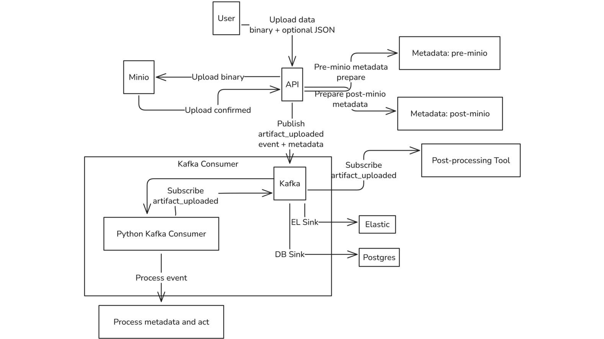
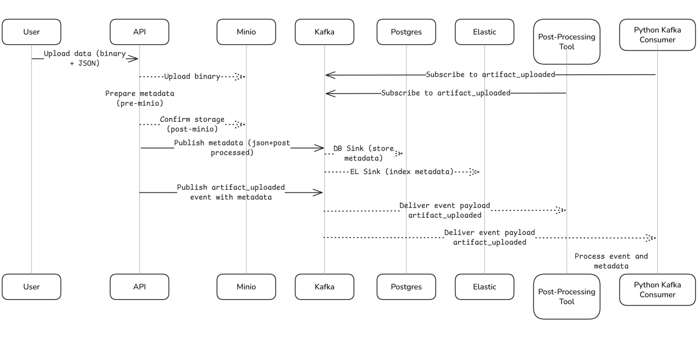

# Artifact Upload Service

This project provides a Dockerized environment for an artifact upload API with Kafka event streaming, Postgres persistence, MinIO (S3-compatible) storage, and Swagger UI for API documentation. The system is designed to handle file uploads, store them in MinIO, stream metadata through Kafka, persist data in Postgres, and update timestamps via a Kafka consumer.

## Overview

The system consists of the following components:
- **Flask API**: A RESTful API built with Flask to handle artifact uploads and publish metadata to Kafka topics.
- **Kafka**: Streams artifact metadata (`artifacts` topic) and notification events (`artifact_uploaded` topic).
- **Kafka Connect**: Integrates Kafka with Postgres (via JDBC sink) and MinIO (via S3 sink) to persist data.
- **Postgres**: Stores artifact metadata in a database.
- **MinIO**: Stores uploaded files in an S3-compatible bucket (`artifacts`).
- **Artifact Consumer**: Consumes notifications from the `artifact_uploaded` topic and updates timestamps in Postgres.





## Prerequisites

- [Docker](https://www.docker.com/get-started)
- [Docker Compose](https://docs.docker.com/compose/)


## Project Structure

```
textailes-api/
├── api.py                # Flask API for artifact uploads
├── artifact_consumer.py  # Kafka consumer for notification processing
├── Dockerfile.api        # Dockerfile for the API service
├── Dockerfile.consumer   # Dockerfile for the artifact consumer service
├── requirements.txt      # Python dependencies
├── static/swagger.json   # Swagger UI

textailesdocker/
├── connectors/           # Kafka Connect configuration files
│   └── postgres-sink.json
├── docker-compose.yml    # Docker Compose configuration
```

## Quick Start

1. **Clone the repository**

   ```bash
   git clone https://github.com/TEXTaiLES/Artifact-pipeline.git
   cd  Artifact-pipeline
   ```

2. **Start the services**
  
   ```bash
   cd textailesdocker
   sudo docker-compose up --build -d
   ```

3. **Access MinIO UI**

   - URL: [http://localhost:9001](http://localhost:9001)
   - Credentials:
     - Username: `minioadmin`
     - Password: `minioadmin`

4. **Access Swagegr UI**

   - Swagger UI: [http://localhost:5000/swagger](http://localhost:5000/swagger)

5. **Register Kafka Connector**

   - Postgres Sink (ensure `connectors/postgres-sink.json` exists):
     ```bash
     cd textailesdocker
     ```

     ```bash
     curl -X POST -H "Content-Type: application/json" \
       --data @connectors/postgres-sink.json \
       http://localhost:8083/connectors
     ```
   - Check the connector status:
   
     ```bash
     curl http://localhost:8083/connectors/artifact-sink/status 
     ```
6. **Test the API**

    - **Upload an artifact**:
      ```bash
      curl -X POST http://localhost:5000/artifacts   -F "file=@myimage"   -F "metadata={\"filename\":\"myimage.png\",\"title\":\"powerpoint\",\"uploaded_by\":\"user123\"};type=application/json"
      ```
      This uploads a file to MinIO, sends metadata to the `artifacts` Kafka topic, and triggers a notification on the `artifact_uploaded` topic.

    - **Query artifacts in Postgres**:
        ```bash
        sudo docker exec -it postgres psql -U admin -d mydb -c "SELECT * FROM artifacts;"
        ```

    - **Check MinIO bucket**:
      Log in to [http://localhost:9001](http://localhost:9001) and verify files in the `artifacts` bucket.

